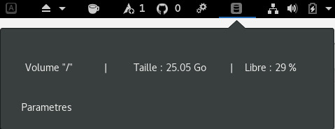

#  Space -- [](https://travis-ci.org/Dev-Crea/space)

Gnome extension for display a disk usage.



## Menu
* [Manual Installation](#manual-installation)
* [Update schemas](#update-schemas)
* [Translate](#translate)
* [Author](#author)

## Manual Installation
Install project manualy :

```linux
cd ~/.local/share/gnome-shell/extensions/
git clone https://github.com/Dev-Crea/space.git
```
Restart gnome (Alt + F2 -> r) or reboot

## Update schemas

```Linux
glib-compile-schemas schemas/
```

## Translate
See [translating](https://github.com/codito/gnome-pomodoro/wiki/Translating)

## Author
[dev-crea](http://dev-crea.com)
